<div align="center">

# Ignacio Palmeri

### IT Management Student · AI-assisted Builder · Support & Automation

Building practical tools with Python, Linux, web dashboards and AI-assisted workflows.

<a href="https://www.linkedin.com/in/ignaciopalmeri/">
  
</a>
<a href="https://github.com/nachopalmeri">
  
</a>
<a href="https://ignaciopalmeri.vercel.app/">
  
</a>
<a href="https://jobbot-lime.vercel.app/">
  
</a>

</div>

---

## Focus

```text
IT Support · Linux · Networking · Python Automation · AI-assisted Development
```

Currently looking for a first part-time, trainee, internship or entry-level tech opportunity.

---

## Activity

<div align="center">

<a href="https://git.io/streak-stats">
  
</a>

<br />




</div>

---

## Tools I am learning and applying

Technologies I am practicing through coursework, personal projects and AI-assisted development workflows.

<p align="center">
  
</p>

---

## Featured work

| Project | What it shows | Links |
|---|---|---|
| **JobBot** | Python automation, Telegram bot flows, FastAPI, dashboard, job alerts and AI-assisted UX. | [Repo](https://github.com/nachopalmeri/jobbot) · [Demo](https://jobbot-lime.vercel.app/) |
| **FranquiYA** | Full-stack operations dashboard for stock, invoices, shifts, employees and audits. | [Repo](https://github.com/nachopalmeri/FranquiYA) |
| **FulboTracker** | Static web app for football matches, tournaments, standings and cost sharing. | [Repo](https://github.com/nachopalmeri/fulbotracker) · [Demo](https://fulbotracker.vercel.app/) |
| **Dulces Creaciones** | Real landing/SEO project for a local business. | [Repo](https://github.com/nachopalmeri/dulcescreaciones) · [Demo](https://dulcescreaciones.vercel.app/) |

---

## Learning

<p align="center">
  
  
  
  
</p>

---

## AI-assisted development

I use AI tools for planning, coding, debugging and documentation — while reviewing, testing and adapting the result to real use cases.

---

<div align="center">

### Open to tech opportunities

Part-time · Trainee · Internship · Entry-level  
Buenos Aires, Argentina

</div>


