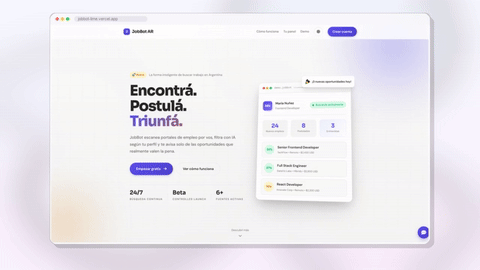
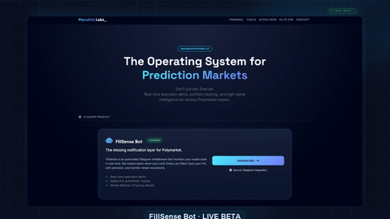
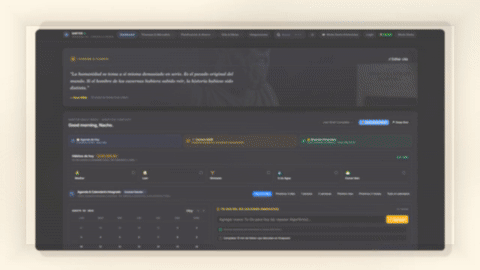
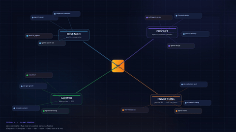

# Ignacio Palmeri

### Junior AI Automation & Product Engineer

Estudiante de Gestión IT (UADE) que convierte procesos repetitivos en software desplegado — Python, FastAPI, bots y asistentes de IA.

---

## Con presión real antes de programar

Antes de tocar código manejé caja, inventario y auditorías en atención al cliente. Esa presión operativa — plata que tiene que cuadrar, stock que tiene que estar, procesos que no pueden fallar — es la que meto en cada herramienta que construyo. No hago ejercicios de curso: hago software que gente real usa para resolver un problema real.

---

## Ver en acción

**JobBot** — SaaS full-stack de búsqueda laboral: auth, webhooks, pagos y alertas en tiempo real.

---

## Proyectos destacados

Cuatro piezas: producto, trabajo, analytics y lab. Cada una con demo en video real, no mockups.

<table>
<tr>
<td width="50%">

**JobBot** · `ACTIVE / AUTOMATION SAAS`
Full-stack builder: dashboard, backend, autenticación, webhooks y despliegue. Next.js · FastAPI · PostgreSQL.

[Abrir proyecto](https://jobbot-lime.vercel.app) · [Ver repo](https://github.com/nachopalmeri/jobbot)

</td>
<td width="50%">

**Pisculichi Labs** · `BETA / PRODUCT LAB`
Laboratorio de bots, alertas y herramientas para prediction markets. Telegram Bot · Alerts · HTML.

[Abrir proyecto](https://polytools-omega.vercel.app) · [Ver repo](https://github.com/nachopalmeri/a)

</td>
</tr>
<tr>
<td width="50%">

**Darter** · `PRIVATE / SISTEMA FINANCIERO PERSONAL`
Command center personal para patrimonio, cartera de CEDEARs y research, con brief diario generado por IA. Next.js · Fintech · AI.

Repo privado — demo en video arriba.

</td>
<td width="50%">

**Agents System** · `LOCAL / WORKFLOW SYSTEM`
Mapa visual de mi sistema local de agentes, reglas y memoria. Orquestación, documentación y pruebas con Playwright.

[Ver repo](https://github.com/nachopalmeri/agents-system)

</td>
</tr>
</table>

---

## Stack

  

`Dashboards` · `Telegram Bots` · `Automation` · `AI-assisted workflows` · `Playwright` · `Prompted code review`

---

## Actividad

 

  

<picture>
  <source media="(prefers-color-scheme: dark)" srcset="https://raw.githubusercontent.com/nachopalmeri/nachopalmeri/output/profile/snake-dark.svg" />
  
</picture>

---

## Certificaciones

  
  
  
  

---

### Más contexto, decisiones técnicas y casos reales

**→ [ignaciopalmeri.vercel.app](https://ignaciopalmeri.vercel.app/)**

Disponible para pasantía o rol trainee · Buenos Aires, Argentina

<!-- last-updated: 2026-09-05 -->
